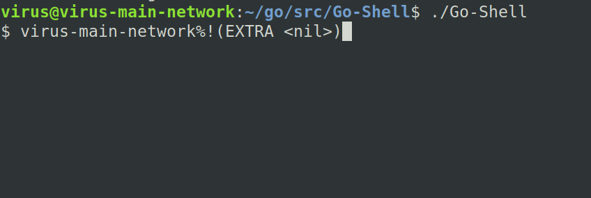

# NiceShell 

A simple Shell Created By using Golang.


I've used Os.Hostname in Os Package To Print The Hostname of the user.

"More Changes coming soon"





For Starting The shell

```
./Go-Shell
```
If It Says Permission Denied Please Give Access By Chmod.


```
chmod +x ./Go-shell
```
